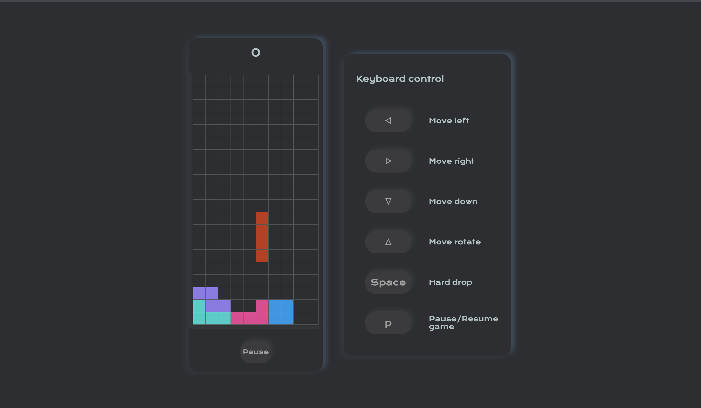

# TetrisJS
___
## Описание: 
### Это классическая игра «Тетрис». Реализована механика падающих фигур, их повороты и перемещения, система счета и проверка на конец игры при достижении верхней границы.
___

___

### Как использовать

- Управление клавишами:
  - Стрелка вверх: Поворот блока.
  - Стрелка вниз: Двигать блок вниз.
  - Стрелка влево: Двигать блок влево.
  - Стрелка вправо: Двигать блок вправо.
  - Пробел: Мгновенное падение блока.
  - P: Пауза/Возобновление игры.


- Игровой процесс:
  - Цель игры - заполнять горизонтальные линии на игровом поле.
  - За каждую удаленную линию вы получаете очки.


- Запуск игры:
  - Нажмите кнопку "Play", чтобы начать игру.
  - Нажмите кнопку "New game", чтобы начать новую игру.

___
## Реализация:
1. Создание игровой доски:
   - В файле `./src/scripts/main.js` создается игровая доска с использованием Dom-элементов. Туда входит генерация 200 клеток, представляющих поле для игры.

```javascript
    let board = document.querySelector('.board-section');
    
    // Генерируем 200 клеток
    for (let i = 0; i < 200; i++) {
        let block = document.createElement('div');
        block.classList.add('block');
        board.appendChild(block);
    }
```

2. Определение форм блоков и их цветов
  - В файле `./src/scripts/constant.js` определены формы блоков, цвета и другие константы, необходимые для игры. Эти данные используются при создании и отрисовке блоков на доске.

```javascript
    const iBlock = [
    [0, 1, 0, 0],
    [0, 1, 0, 0],
    [0, 1, 0, 0],
    [0, 1, 0, 0],
  ];
  
  const COLORS = [
    '#c23616',
    '#0097e6',
    '#44bd32',
    '#e1b12c',
    '#8c7ae6',
    '#e84393',
    '#00cec9'
  ];
```

3. Создание игровой логики
  - Файл  `./src/scripts/app.js` содержит основные функции для управления игровым процессом:
    - `newGrid`: Создание новой игровой сетки.
    - `resetGrid`: Сброс игровой сетки и цвета поля.
    - `newTetromino`: Создание нового блока.
    - `drawTetromino` и `clearTetromino`: Отрисовка и очистка блока на доске.
    - Функции для перемещения, вращения и падения блока.
    - `updateGrid`: Обновление сетки при падении блока.
    - `checkFilledRow` и `deleteRow`: Проверка и удаление заполненных строк.
    - `checkGrid`: Проверка сетки на наличие заполненных строк.

### Основные алгоритмы:

1. Алгоритм движения блока:

```javascript
  movable = (tetromino, grid, direction) => {
      let newX = tetromino.x;
      let newY = tetromino.y;
  
      // Вычисление новых координат в зависимости от направления
      switch(direction) {
          case DIRECTION.DOWN:
              newX = tetromino.x + 1;
              break;
          case DIRECTION.LEFT:
              newY = tetromino.y - 1;
              break;
          case DIRECTION.RIGHT:
              newY = tetromino.y + 1;
              break;
      }
  
      // Проверка, все ли клетки блока могут переместиться в новые координаты
      return tetromino.block.every((row, i) => {
          return row.every((value, j) => {
              let x = newX + i;
              let y = newY + j;
              return value === 0 || (isInGrid(x, y, grid) && !isFilled(x, y, grid));
          });
      });
  };
```

2. Алгоритм проверки заполненных строк:

```javascript
    checkFilledRow = (row) => {
      return row.every(v => {
        return v.value !== 0;
      });
    };
    
    deleteRow = (row_index, grid) => {
      for (let row = row_index; row > 0; row--) {
        for (let col = 0; col < 10; col++) {
          // Перемещение значений из верхней строки в текущую
          grid.board[row][col].value = grid.board[row - 1][col].value;
          let value = grid.board[row][col].value;
          // Обновление цвета поля
          field[grid.board[row][col].index].style.background = value === 0 ? TRANSPARENT : COLORS[value - 1];
        }
      }
    };
```

3. Алгоритм вращения блока:

```javascript
    rotatable = (tetromino, grid) => {
    // Клонирование блока
    let cloneBlock = JSON.parse(JSON.stringify(tetromino.block));
  
    // Поворот клонированного блока
    for (let y = 0; y < cloneBlock.length; y++) {
      for (let x = 0; x < y; ++x) {
        [cloneBlock[x][y], cloneBlock[y][x]] = [cloneBlock[y][x], cloneBlock[x][y]];
      }
    }
    cloneBlock.forEach(row => row.reverse());
  
    // Проверка видимости повернутого блока
    return cloneBlock.every((row, i) => {
      return row.every((value, j) => {
        let x = tetromino.x + i;
        let y = tetromino.y + j;
        return value === 0 || (isInGrid(x, y, grid) && !isFilled(x, y, grid));
      });
    });
  };
 ```

4. Алгоритм мгновенного падения блока:

```javascript
    hardDrop = (tetromino, grid) => {
    // Очистка предыдущего положения блока
    clearTetromino(tetromino, grid);
    // Пока блок может двигаться вниз, увеличиваем координату X
    while (movable(tetromino, grid, DIRECTION.DOWN)) {
      tetromino.x++;
    }
    // Отрисовка блока в новом положении
    drawTetromino(tetromino, grid);
  };
```

5. Алгоритм игрового цикла:

```javascript
  gameLoop = () => {
    // Проверка состояния игры
    if (game.state === GAME_STATE.PLAY) {
      // Если блок может двигаться вниз, двигаем вниз
      if (movable(tetromino, grid, DIRECTION.DOWN)) {
        moveDown(tetromino, grid);
      } else {
        // Обновление сетки и проверка на заполненные строки
        updateGrid(tetromino, grid);
        checkGrid(grid);
        // Создание нового блока
        tetromino = newTetromino(BLOCKS, COLORS, START_X, START_Y);
  
        // Проверка, полна ли сетка - конец игры
        if (movable(tetromino, grid, DIRECTION.DOWN)) {
          drawTetromino(tetromino, grid);
        } else {
          // Игра завершена
          game.state = GAME_STATE.END;
          let body = document.querySelector('body');
          body.classList.add('end');
          body.classList.remove('play');
  
          let rs_score = document.querySelector('#result-score');
  
          rs_score.innerHTML = game.score;
        }
      }
    }
  };
```

### Обработка событий:

1. Обработка событий клавиатуры:

```javascript
    document.addEventListener('keydown', e => {
    let body = document.querySelector('body');
    e.preventDefault();
    let key = e.which;
    switch(key) {
      case KEY.DOWN:
        moveDown(tetromino, grid);
        break;
      case KEY.LEFT:
        moveLeft(tetromino, grid);
        break;
      case KEY.RIGHT:
        moveRight(tetromino, grid);
        break;
      case KEY.UP:
        rotate(tetromino, grid);
        break;
      case KEY.SPACE:
        hardDrop(tetromino, grid);
        break;
      case KEY.P:
        let btn_play = document.querySelector('#btn-play');
        if (game.state !== GAME_STATE.PAUSE) {
          gamePause();
          body.classList.add('pause');
          body.classList.remove('play');
          btn_play.innerHTML = 'resume';
        } else {
          body.classList.remove('pause');
          body.classList.add('play');
          gameResume();
        }
    }
  });
 ```

2. Обработка событий кнопок:

```javascript
  let btns = document.querySelectorAll('[id*="btn-"]');

  btns.forEach(e => {
    let btn_id = e.getAttribute('id');
    let body = document.querySelector('body');
    e.addEventListener('click', () => {
      switch(btn_id) {
        case 'btn-drop':
          hardDrop(tetromino, grid);
          break;
        case 'btn-up':
          rotate(tetromino, grid);
          break;
        case 'btn-down':
          moveDown(tetromino, grid);
          break;
        case 'btn-left':
          moveLeft(tetromino, grid);
          break;
        case 'btn-right':
          moveRight(tetromino, grid);
          break;
        case 'btn-play':
          body.classList.add('play');
          if (game.state === GAME_STATE.PAUSE) {
            body.classList.remove('pause');
            gameResume();
            return;
          }
          gameStart();
          break;
        case 'btn-pause':
          gamePause();
          let btn_play = document.querySelector('#btn-play');
          btn_play.innerHTML = 'Resume';
          body.classList.remove('play');
          body.classList.add('pause');
          break;
        case 'btn-new-game':
          gameReset();
          body.classList.add('play');
          body.classList.remove('pause');
          body.classList.remove('end');
          gameStart();
          break;
      }
    })
  });
```